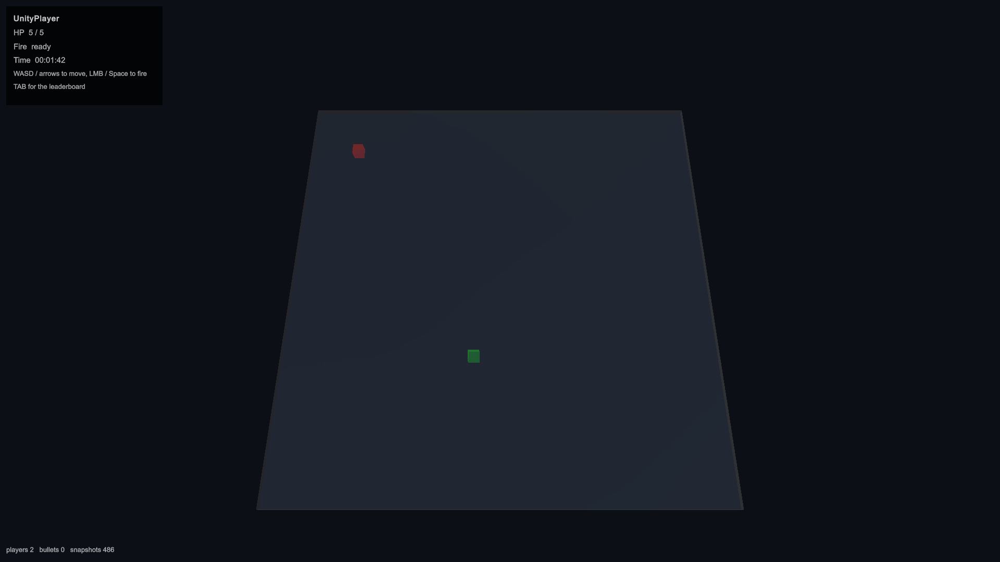
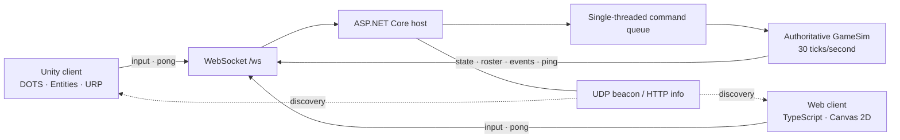

<div align="center">

# Multiplayer Arena

**One authoritative world. Two completely different clients.**

A never-ending top-down deathmatch served by .NET and rendered in either a
Unity DOTS 3D client or a lightweight TypeScript 2D browser client.


</div>



## What is it?

Multiplayer Arena is a compact demonstration of server-authoritative multiplayer
architecture. A headless C# server owns movement, collision, projectiles, damage,
respawning, and scoring. Both clients are intentionally thin: they send input, consume
the same snapshot stream, and present a consistent view of the arena.

- **Cross-client play** — Unity, Unity WebGL, and browser players share one match.
- **Server-authoritative simulation** — clients never decide gameplay outcomes.
- **Smooth snapshot rendering** — both clients interpolate roughly 100 ms behind the
  latest authoritative state.
- **LAN discovery** — native clients listen for UDP beacons; browser runtimes discover
  servers through HTTP probes.
- **Drop-in sessions** — join at any time, reconnect under the same name, and keep the
  session's score history.
- **No match timer limit** — the arena runs continuously until the server stops.

## Architecture



The simulation core has no networking, threading, or wall-clock dependency. Socket work
is queued and applied by one fixed-rate tick loop, keeping state mutation deterministic
and lock-free. Outbound traffic uses a bounded channel per connection, so a slow client
cannot stall the arena.

Snapshots are JSON text frames broadcast at **30 Hz**. The compact, versioned protocol is
shared by both clients and includes world state, roster updates, transient combat events,
and ping/pong latency measurement. See the [wire protocol](docs/specs/26_09_08_09_multiplayer_arena/protocol.md)
for message schemas and coordinate mapping.

## Technology

| Area | Stack | Role |
|---|---|---|
| Server | C# · .NET 9 · ASP.NET Core | WebSocket/HTTP host and fixed-step game loop |
| Simulation | Dependency-free C# class library | Movement, separation, swept projectile collision, health, score, respawn |
| Unity client | Unity 6000.5 · Entities 1.4 · Entities Graphics · URP · Unity UI Toolkit · Input System | Runtime-created 3D entities, interface, rendering, input, interpolation |
| Web client | TypeScript 5.7 · Vite 6 · Canvas 2D | Framework-free browser client with responsive high-DPI rendering |
| Discovery | UDP broadcast · HTTP `/api/info` | LAN discovery across native and browser-constrained runtimes |
| Testing | xUnit · Unity Test Framework · Vitest · headless integration bots | Simulation, protocol, interpolation, input, rendering math, live multiplayer flow |

The Unity client builds meshes and URP materials at runtime—there are no baked gameplay
prefabs or authored art dependencies. Native builds use `ClientWebSocket`; WebGL swaps in
a small JavaScript bridge to use the browser's WebSocket API.

## Quick start

### 1. Start the server

Requires the [.NET 9 SDK](https://dotnet.microsoft.com/download/dotnet/9.0).

```sh
dotnet run --project Server/MultiplayerDemo.Server
```

The default arena listens on `http://localhost:8080`, with its game socket at
`ws://localhost:8080/ws`.

Run another named arena on a different port:

```sh
dotnet run --project Server/MultiplayerDemo.Server -- --port 8081 --name "Second Arena"
```

### 2. Choose a client

#### Browser

Requires a current Node.js release and npm.

```sh
cd WebClient
npm install
npm run dev
```

Open `http://localhost:5173`, choose a player name, and connect to
`localhost:8080`. Open another tab with a different name to test multiplayer locally.

#### Unity

Open `UnityClient` in **Unity 6000.5.5f1**, load `Assets/Scenes/Arena.unity`, and press
Play. Enter a unique player name and connect to `localhost:8080`. The same scene supports
standalone and WebGL builds.

More client-specific notes are available in the [web client guide](WebClient/README.md)
and [Unity client guide](UnityClient/README.md).

## Controls

| Input | Action |
|---|---|
| <kbd>W</kbd><kbd>A</kbd><kbd>S</kbd><kbd>D</kbd> or arrow keys | Move |
| Left mouse button or <kbd>Space</kbd> | Fire in the last movement direction |
| <kbd>Tab</kbd> | Toggle the leaderboard |

Each player starts with **5 HP**. Shots deal **1 damage** with a **0.5 second cooldown**.
After a death, the player respawns at a free location after **5 seconds**. The leaderboard
tracks kills, deaths, connection status, client type, address, and latency.

## Endpoints and discovery

| Interface | Default | Purpose |
|---|---|---|
| WebSocket | `ws://<host>:8080/ws` | Join, input, snapshots, roster, events, ping/pong |
| HTTP | `GET http://<host>:8080/api/info` | Server metadata and player count |
| UDP | Broadcast port `47777` | Native LAN server discovery, once per second |

Native Unity clients receive the UDP beacon directly. Browsers—including Unity WebGL—
cannot listen for UDP, so they probe `/api/info` on candidate local ports instead. A
manually entered `host:port` works in every client.

## Tests

Run the server simulation suite:

```sh
dotnet test Server/MultiplayerDemo.sln
```

Run the web unit suite and production build:

```sh
cd WebClient
npm test
npm run build
```

With a server running, exercise a complete two-player kill and respawn sequence:

```sh
cd WebClient
npm run test:integration -- --server localhost:8080
```

Unity EditMode tests are available under **Window → General → Test Runner**. Together the
suites cover arena bounds, player separation, cooldowns, swept projectile hits, damage,
death and respawn, protocol parsing, interpolation, input, formatting, discovery, and
renderer transforms.

## Repository layout

```text
MultiplayerDemo/
├── Server/
│   ├── MultiplayerDemo.Core/      # Pure authoritative simulation
│   ├── MultiplayerDemo.Server/    # ASP.NET Core host, sessions and discovery
│   └── MultiplayerDemo.Tests/     # xUnit simulation tests
├── UnityClient/
│   ├── Assets/Scripts/Ecs/        # Entities components and systems
│   ├── Assets/Scripts/Net/        # Protocol, transports and discovery
│   └── Assets/Tests/EditMode/     # Unity client tests
├── WebClient/
│   ├── src/                       # Browser client modules
│   ├── tests/                     # Vitest unit tests
│   └── tools/                     # Headless bot and integration runner
└── docs/specs/                    # Requirements, plan and frozen protocol
```

## Design boundaries

This demo focuses on the foundations of a readable cross-runtime multiplayer system.
Client-side prediction, rollback, authentication, persistence, matchmaking, teams, and
obstacles are intentionally out of scope. Disconnected players remain on the leaderboard
until the server restarts.

## License

Released under the [MIT License](LICENSE).
